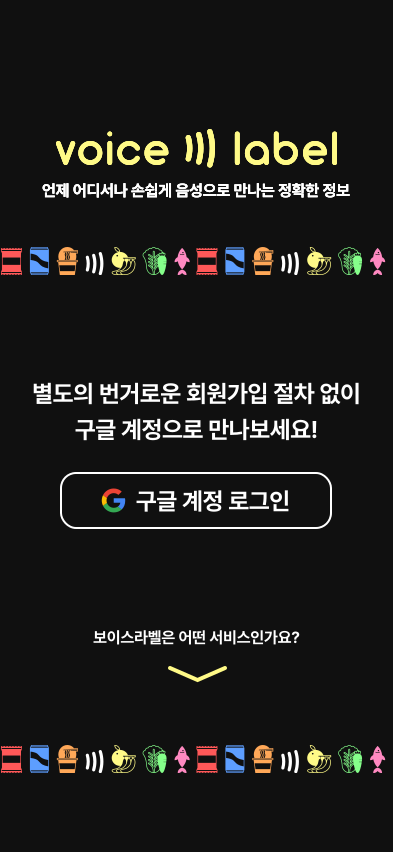

# 📢 Voice Label 서비스

Voice Label은 시각 장애인 사용자가 편의점 제품을 식별하고 이미지 인식을 통해 제품의 상세 정보와 영양 정보를 음성 피드백으로 제공하는 웹 서비스입니다.

<br />

## 📎 기능

- **Google 로그인 이용**: Google 로그인 API를 사용하여 사용자 인증 및 프로필 접근을 용이하게 합니다.


- **제품 식별**: Teachable Machine 이미지 분류를 사용하여 제품을 인식하고, 화면을 두 번 터치하면 구매 기록으로 데이터를 전송합니다.


- **음성 피드백**: `react-speech-recognition`을 사용하여 음성 명령을 구현하고 제품 상세 정보 및 영양 정보를 제공합니다.


- **카메라 호환성**: Chrome, Safari, Kakao 브라우저에서 카메라 기능이 정상 작동하는지 확인합니다.

<br/>

- **결제 통합**: `tosspayments`를 사용하여 결제 거래를 원활하게 처리합니다.


<br/>

- **기록 및 구독 관리**: 사용자 프로필을 통해 구매 기록과 구독을 관리합니다.


## 📜 페이지

- **로그인 페이지**: Google 로그인을 사용하여 사용자 인증을 허용합니다.
- **메인 페이지**: 로그인 후 홈페이지입니다.
- **스캔 페이지**: 카메라 입력을 사용한 제품 스캔.
- **피드백 페이지**: 사용자가 제품 정보 정확성에 대한 피드백을 제공할 수 있습니다.
- **마이 페이지**: 구독 세부 정보와 사용자의 구매 기록이 포함됩니다.

## ⚙️ 기술

### 프론트엔드

- **react-webcam**: 웹캠 기능을 처리합니다.
- **Teachable Machine 이미지 분류**: 제품을 인식하는 AI를 제공합니다.
- **react-speech-recognition**: 음성 인식 기능을 제공합니다.
- **Text to Speech**: 외부 라이브러리 없이 기본적으로 구현됩니다.
- **상태 관리**: `recoil`을 사용하여 로그인 및 구독 상태를 관리합니다.

### 백엔드

- **Spring JPA**: 데이터 관리를 위해 Spring Data JPA를 사용합니다.
- **MySQL (RDS)**: 데이터베이스는 Amazon RDS를 활용한 MySQL을 사용합니다.
- **Swagger**: API 문서화.
- **Actuator**: 건강 상태 모니터링(health check).
- **Spring Security & OAuth2.0 Google**: 애플리케이션을 보호하고 인증을 관리합니다.
- **Toss Payments 통합**: 결제 처리를 관리합니다.


## 📌 설치

Node.js가 기기에 설치되어 있는지 확인한 후, 프로젝트 디렉토리에서 다음 명령어를 실행하세요:

```bash
npm install
npm install --save react-speech-recognition
npm install @reduxjs/toolkit react-redux
npm install axios
npm install jwt-decode
npm install --save react-scroll
npm install @tosspayments/payment-sdk --save
npm install recoil
```

애플리케이션 실행
애플리케이션을 시작하려면 프로젝트 디렉토리로 이동하여 다음을 실행하세요:

```bash
npm start
```
선호하는 브라우저에서 서버 주소로 이동하여 배포를 확인하세요.

## ☑️ 테스트
모든 기능이 다양한 브라우저에서 예상대로 작동하는지 확인하세요, 특히 카메라 접근 및 음성 인식 기능을 확인합니다.


## 팀 소개

- **기획**: 김리사
- **디자인**: 최성희
- **프론트엔드**: 김수아, 노경인
- **백엔드**: 이주승, 박진홍